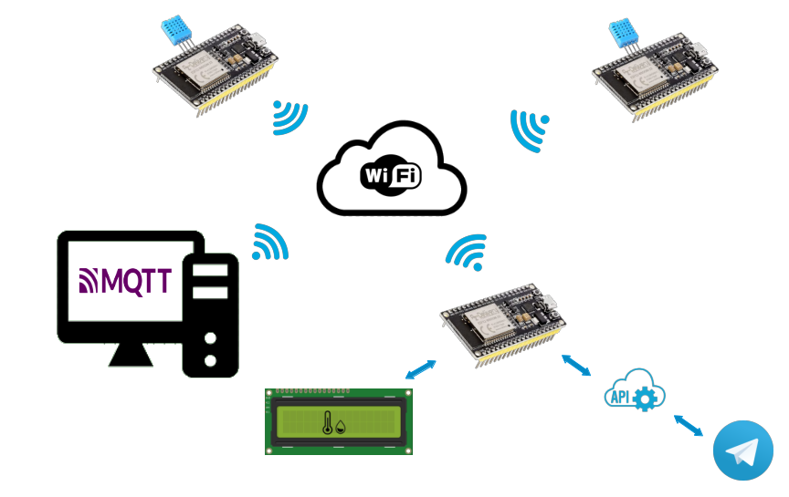

# ESP32 distribuited Thermometer

## Introduction

We made this project for an university exam, but also for improve our skill with microcontrollers, arduino and electonic in general. We started with the idea of creating a thermometer that can be viewed via telegram bot and during the implementation we decided to add some functionalities. Use of MQTT IOT protocol, photoresistor to measure brightness, use of multiple sensors and display the information locally with a LCD.

Below is a diagram of the complete project.

## How to build it

#### Component list

#### Gateway

#### Sensor

## Communication

#### Wifi

#### MQTT

#### Telegram

#### MultiCore
