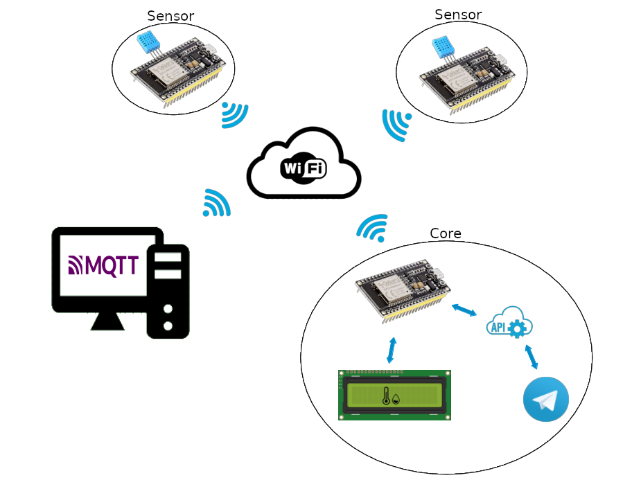

# ESP32 distribuited Thermometer

## Introduction

We made this project for an university exam, but also for improve our skill with microcontrollers, arduino and electonic in general. We started with the idea of creating a thermometer that can be viewed via telegram bot and during the implementation we decided to add some functionalities. Use of MQTT IOT protocol, photoresistor to measure brightness, use of multiple sensors, connectable from different WiFi networks, and display the information locally with a LCD.

### Security Disclaimer

To make comunication between sensors and core easier we decide to use an online MQTT Broker ([http://www.mqtt-dashboard.com]()) that not requires credentials. Consequently the messagges from sensor are public and anyone can see them and even worse can send false data that the core will display.

In a real application sensors will publish data on a private MQTT Broker with authentication (User, Password). In this way the security of the system improves a lot.

## How to build it

### Core of the system

##### Component List

- 1x ESP32 (with 5v output from USB)

- 1x 1602 LCD Display (we use not I2C version)

- 1x 10KΩ Trimmer

- 1x Button

- 1x 10KΩ Resistor

- Wire

##### Circuit

#### Sensor

##### Component List

- 1x ESP32 (with 5v output from USB)

- 1x 10KΩ Resistor

- 1x DHT11 Module

- 1x Photoresistor GL55

- Wire

##### Circuit

## Communication

#### Wifi

#### MQTT

#### Telegram

#### MultiCore
